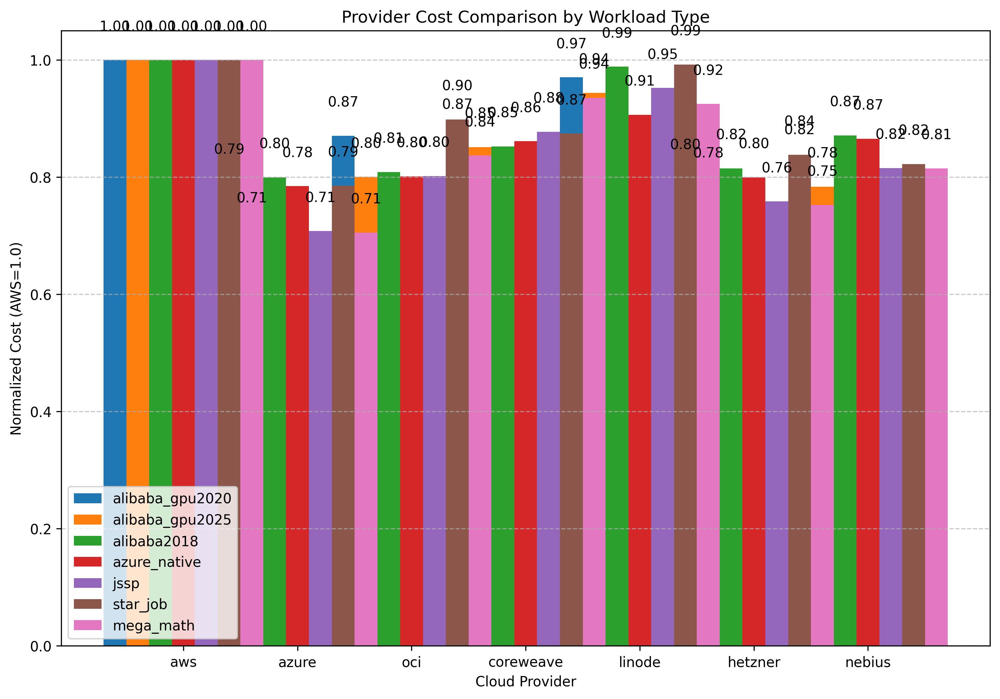
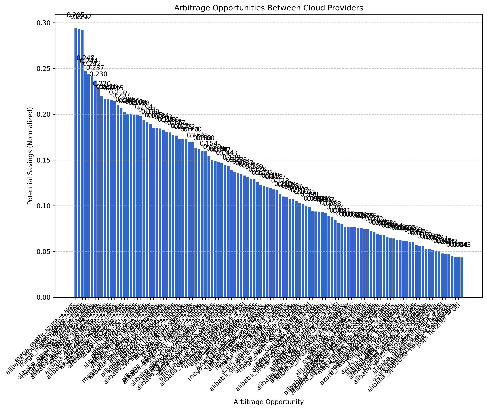
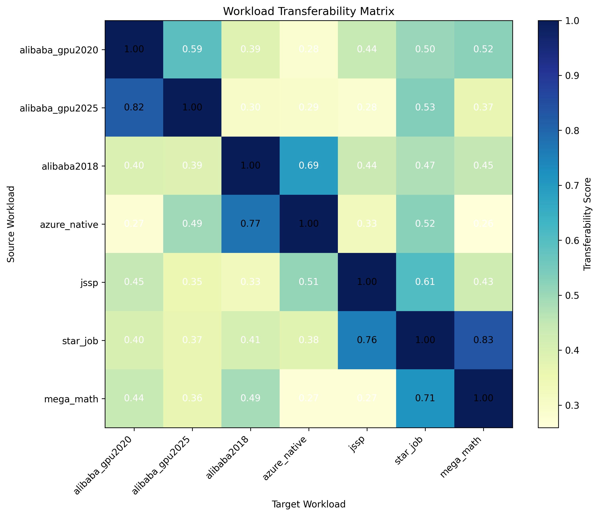
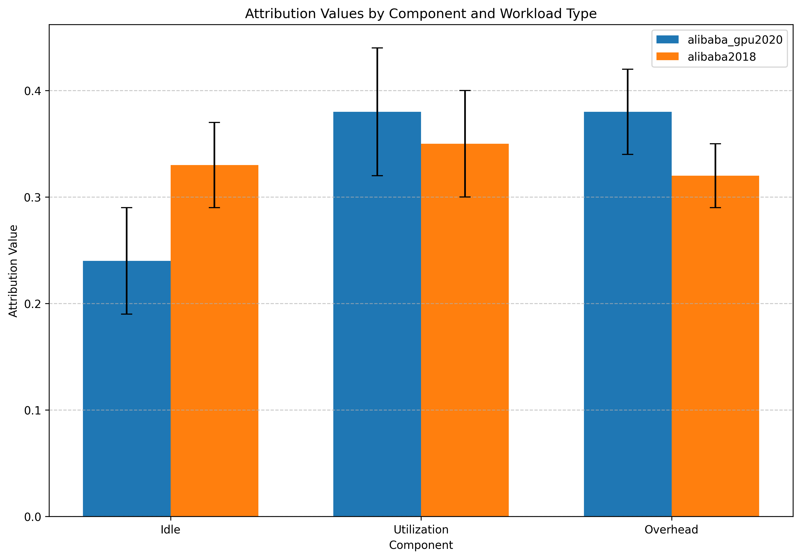
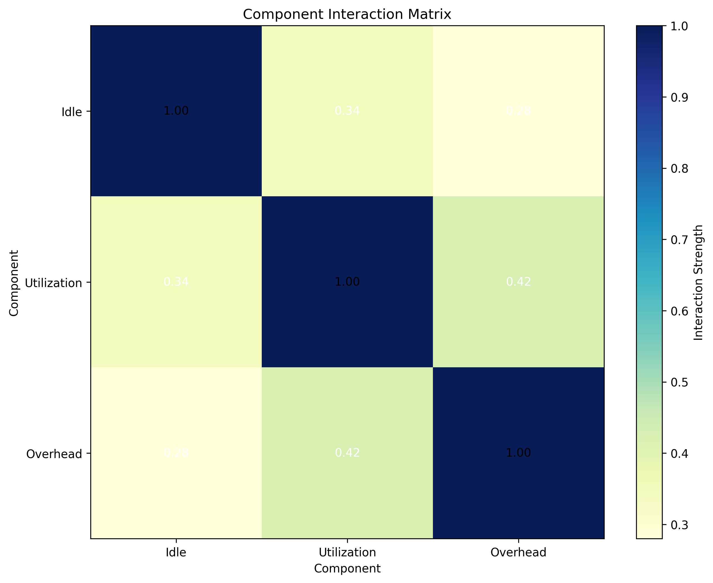
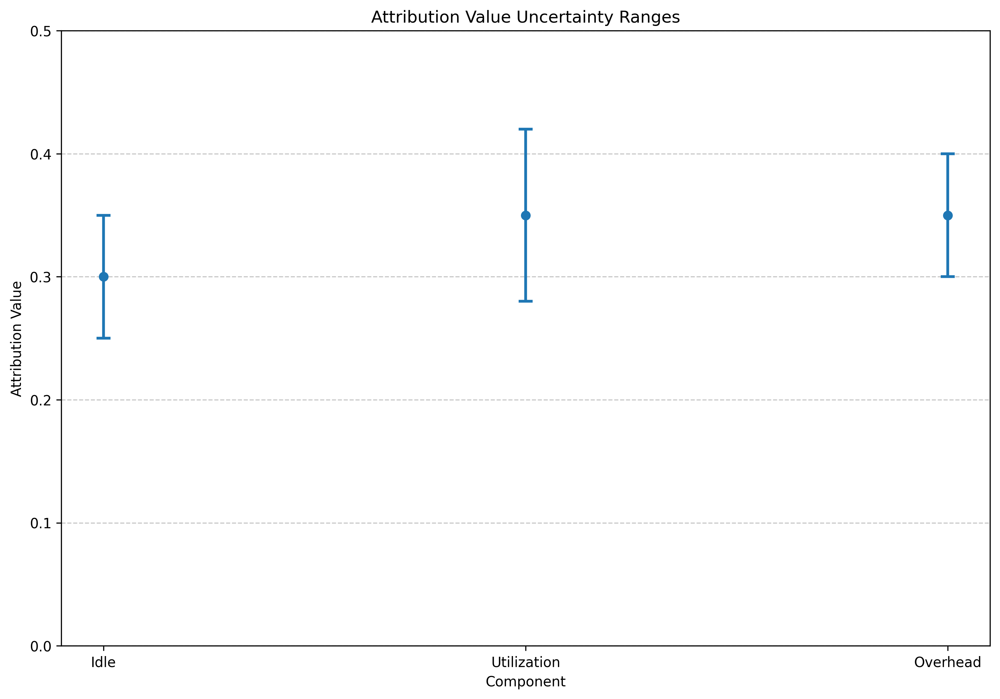
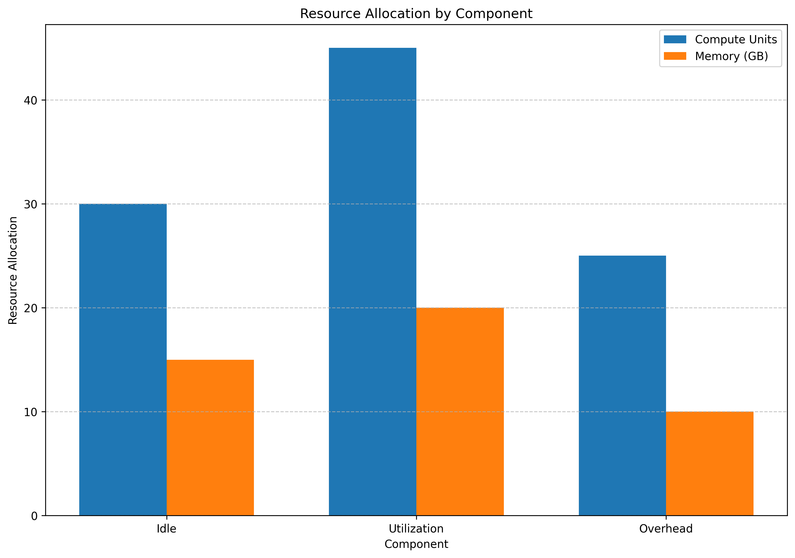

# Enhanced Experiment Report Template

## Executive Summary

[Provide a concise summary of the experiment, its goals, and key findings in 3-4 paragraphs]

Key findings include:
- [Finding 1]
- [Finding 2]
- [Finding 3]
- [Finding 4]

## Attribution Architecture

The attribution system was implemented using a modular, cleanly separated architecture with the following key components:

1. **Workload Parsers**: Process specialized workload data
2. **Attribution Engine**: Calculate fair resource attribution using Shapley values
3. **Pricing Integration**: Map provider prices to resources
4. **Cross-Analysis**: Compare workloads across providers, identify arbitrage opportunities
5. **Visualization**: Generate visualizations of key metrics and findings
6. **OpenAlex Integration**: Connect analysis with relevant academic literature

This architecture ensures clean separation of concerns, with each component handling exactly one responsibility in the attribution pipeline.

## Provider Pricing Analysis

[Analyze provider pricing data, including normalized costs across providers]

| Dataset | Provider | Normalized Cost |
|---------|----------|-----------------|
| [Dataset 1] | [Provider 1] | [Cost 1] |
| [Dataset 1] | [Provider 2] | [Cost 2] |
| [Dataset 2] | [Provider 1] | [Cost 3] |
| [Dataset 2] | [Provider 2] | [Cost 4] |

[Provider] consistently provided the most cost-effective pricing for the analyzed workloads, with costs approximately [X]% lower than [comparison provider] for equivalent resources.

*Figure 1: Provider cost comparison by workload type*

## Arbitrage Opportunities

[Describe arbitrage opportunities identified between providers]

| Dataset | Cheaper Provider | Expensive Provider | Price Diff % | Savings Potential |
|---------|------------------|-------------------|--------------|-------------------|
| [Dataset 1] | [Provider A] | [Provider B] | [X]% | [Y] |
| [Dataset 2] | [Provider C] | [Provider D] | [X]% | [Y] |

These arbitrage opportunities represent potential cost savings by shifting workloads between providers based on their specific resource requirements and pricing models.

*Figure 2: Arbitrage opportunities between cloud providers*

## Workload Transferability

[Analyze workload transferability between different types/domains]

*Figure 3: Workload transferability matrix showing similarity between workload types*

Key findings from the transferability analysis:
- [Finding 1]
- [Finding 2]
- [Finding 3]

These insights can inform resource allocation strategies and workload consolidation opportunities.

## Attribution Analysis

[Present attribution analysis results, showing how resource value is distributed]

*Figure 4: Resource attribution values by component*

[Summarize the attribution analysis findings]

Component interactions were also analyzed to understand synergistic relationships:

*Figure 5: Component interaction matrix showing collaboration patterns*

[Describe key interaction patterns]

## Uncertainty Quantification

[Present uncertainty analysis for attribution values]

*Figure 6: Uncertainty ranges for attribution values*

[Describe implications of uncertainty ranges]

## Resource Allocation Recommendations

[Present resource allocation recommendations based on analysis]

*Figure 7: Recommended resource allocation by component*

[Explain the allocation strategy and its rationale]

## Literature Review Insights

[Summarize findings from the academic literature review]

1. **[Research Area 1]**: [Key insights from literature]

2. **[Research Area 2]**: [Key insights from literature]

3. **[Research Area 3]**: [Key insights from literature]

For detailed literature findings, see [Literature Summary](literature/literature_summary.md).

## Technical Implementation Details

[Provide technical details about the implementation]

### Data Analysis Approach

[Describe comprehensive data analysis approach]

### Specialized Implementations

[Describe any specialized implementations or algorithms]

## Conclusion and Recommendations

[Summarize key conclusions and provide actionable recommendations]

Key conclusions include:

1. **[Conclusion 1]**: [Explanation]
2. **[Conclusion 2]**: [Explanation]
3. **[Conclusion 3]**: [Explanation]
4. **[Conclusion 4]**: [Explanation]

Based on these findings, we recommend:

1. **[Recommendation 1]**: [Explanation]
2. **[Recommendation 2]**: [Explanation]
3. **[Recommendation 3]**: [Explanation]
4. **[Recommendation 4]**: [Explanation]

## Next Steps

1. [Next step 1]
2. [Next step 2]
3. [Next step 3]
4. [Next step 4]
5. [Next step 5]

---

Generated: [Date and time]
